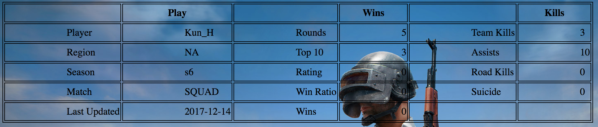

# User Manual

By using this application, the user can access statistics from PlayerUnknown's Battlegrounds without logging into the game.

Retrieving the Game Stats:

- Type a player name into the search box and click "search". This retrieves the data that matches the corresponding name in the database.

- The results are then displayed in a table and broken down into three columns for general gameplay information, wins, and kills.

